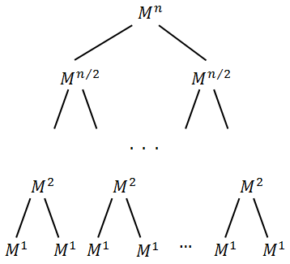

# What is fibonacci sequence

Let's see a sequence: 
<br>
0, 1, 1, 2, 3, 5, 8, 13, 21, 34, 55, 89, 144, 233, 377, 610, 987, 1597, 2584, 4181, 6765, 10946, 17711, 28657, 46368, 75025, 121393, 196418, 317811, ...

<br>
This is the fibonacci sequence generated by the rule:

<br>
-> x_{n}=x_{n-1} + x_{n-2}


# How to compute n^th fibonacci number?

## 1. Brute Force (Recursion)

Even though it seems a little bit tricky to calculate a specific fibonacci number, it actually easy writing down the formula:
 
* x_{0}=0
* x_{1}=x_{2}=1
* x_{n}=x_{n-1} + x_{n-2} (n > 2)

Since we have written down the formula, it's not too hard to write down the recursion code:

```java
public int fib(n) {
    if (n == 0) {
        return 0;
    }
    if (n == 1 || n == 2) {
        return 1;
    }
    return fib(n - 1) + fib(n - 2);
}
```
### Time Complexity Analysis
Let's set T(n) time for fib(n), and C means constant time which includes if logic operation and add operation.
```
T(n) = T(n-1) + T(n-2) + C
T(n - 1) > T(n - 2), so T(n - 1) apporx. T(n - 2)
T(n) ~~ T(n-1) + T(n-1) + C
T(n) ~~ 2T(n-1) + C && T(n-1) ~~ 2T(n-2) + C
T(n) ~~ 2( 2T(n-2) + C ) + C
T(n) ~~ 2( 2(2T(n-3) + C) + C ) + C

...

T(n) ~~ 2*2*2(T(n-3)) +(2^0 +2^1 +2^2)*C
T(n) ~~ 2^k(T(n-k)) + (2^k-1)*C
let n=k, 
T(n) ~~ 2^n(T(0)) + (2^n-1)*C, && T(0) = 1time because if(n == 0) return 0
T(n) ~~ 2^n*1t  + C
So the we have the upper bound O(2^n)
Similar, if we use T(n-2) ~~ T(n-1)
T(n) ~~ T(n-2) + T(n-2) + C
Then T(n) ~~ 2^(n/2)*1t + C

So time complexity is O(2^(n/2)) ~ O(2^n)

```
https://www.youtube.com/watch?v=pqivnzmSbq4
<br>

Actually, there is a mathematical way to solve fibonacci sequence. For explanation for detail, a link in youtube in the blow of the article.
<br>


## 2. Using power of the matrix {{1,1},{1,0}} 
```java
public int fib(n) {
    int F[][] = new int[][]{{1, 1}, {1, 0}};
    if (n == 0) {
        return 0;
    }
    power(F, n-1);
    return F[0][0];
}

static void multiply(int F[][], int M[][]) {
    int x = F[0][0]*M[0][0] + F[0][1]*M[1][0];
    int y = F[0][0]*M[0][1] + F[0][1]*M[1][1];
    int z = F[1][0]*M[0][1] + F[1][1]*M[1][0];
    int w = F[1][0]*M[0][1] + F[1][1]*M[1][1];

    F[0][0] = x;
    F[0][1] = y;
    F[1][0] = z;
    F[1][1] = w;
}

static void power(int F[][], int n) {
    int M[][] = new int[][]{{1, 1}, {1, 0}};

    for (int i = 2; i <= n; i++) {
        multiply(F, M);
    }
}
```

### Time Complexity Analysis
Within the power function, it iterates multiply function for ~n time, so O(n)

## 3. Using power of the matrix {{1,1},{1,0}} Optimized Method
```java
public int fib(int n) {
    int F[][] = new int[][]{{1, 1}, {1, 0}}.
    if (n == 0) return 0;
    power(F, n-1);
    return F[0][0];
}
static void multiply(int F[][], int M[][]) {
    int x = F[0][0]*M[0][0] + F[0][1]*M[1][0];
    int y = F[0][0]*M[0][1] + F[0][1]*M[1][1];
    int z = F[1][0]*M[0][0] + F[1][1]*M[1][0];
    int w = F[1][0]*M[0][1] + F[1][1]*M[1][1];

    F[0][0] = x;
    F[0][1] = y;
    F[1][0] = z;
    F[1][1] = w;
}

static void power(int F[][], int n) {
    if (n == 0 || n == 1) {
        return;
    }
    int M[][] = new int[][]{{1, 1}, {1, 0}};

    power(F, n/2);
    multiply(F, F);

    if (n%2 != 0) {
        multiply(F, M);
    }
}
```
### Time Complexity Analysis
If we draw the tree of accumulation, then we can see the actual height is logn.
That is to say, for N-number summation, the time increase by logn. Time complexity: O(logn)  


## Interview Challenge: find the last 4 digits of fib number in O(logn)
mod summation formula:  
**(A + B) mod C = (A mod C + B mod C) mod C**

```java
    public String lastFourDigitsOfFn(int n) {
        
        int[][] f = {{1, 1}, {1, 0}};

        if (n == 0) return "0";

        power(f, n-1);

        String s = "" + f[0][0];

        while (s.length() < 4) {
            s = "0" + s;  
        }

        return s;
    }

    private static void power(int[][] f, int n) {
        int[][] m = {{1, 1}, {1, 0}};

        if (n == 1) return;

        power(f, n/ 2);
        multiply(f, f, 10000);

        if (n %2 == 0) return;

        multiply(f, m, 10000);
        return;
    }

    private static void multiply(int[][] f1, int[][] f2, int n) {
        
        int x = (f1[0][0]*f2[0][0]%n + f1[0][1]*f2[1][0]%n) %n;
        int y = (f1[0][0]*f2[0][1]%n + f1[0][1]*f2[1][1]%n) %n;
        int p = (f1[1][0]*f2[0][0]%n + f1[1][1]*f2[1][0]%n) %n;
        int q = (f1[1][0]*f2[0][1]%n + f1[1][1]*f2[1][1]%n) %n;

        f1[0][0] = x;
        f1[0][1] = y;
        f1[1][0] = p;
        f1[1][1] = q;

        return;
    }


```


More (Program for Fibonacci numbers): https://www.geeksforgeeks.org/program-for-nth-fibonacci-number/
Log(n) time explanation: https://kukuruku.co/post/the-nth-fibonacci-number-in-olog-n/